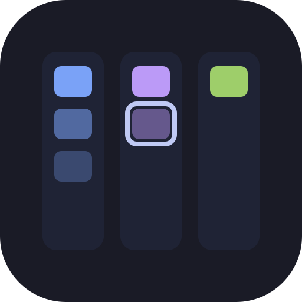
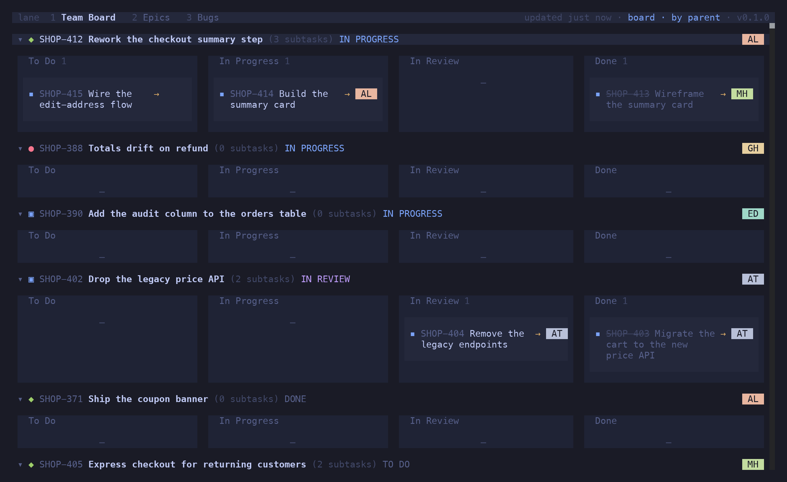
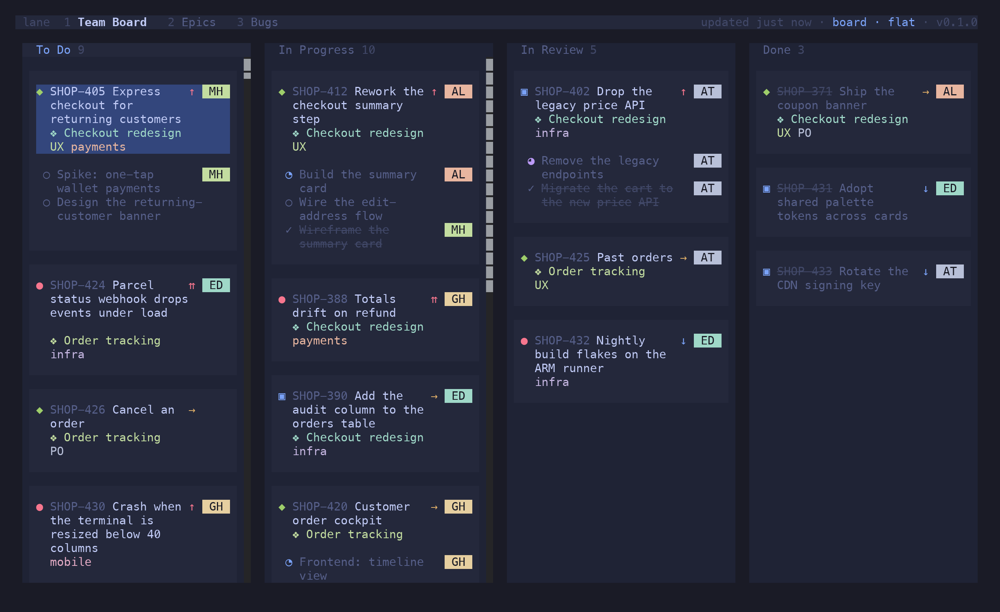
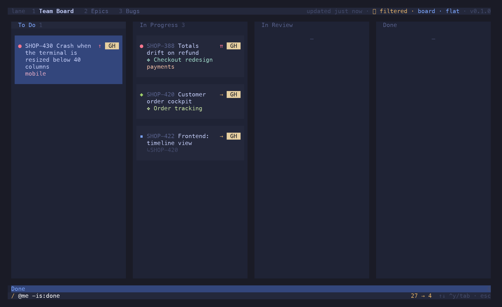
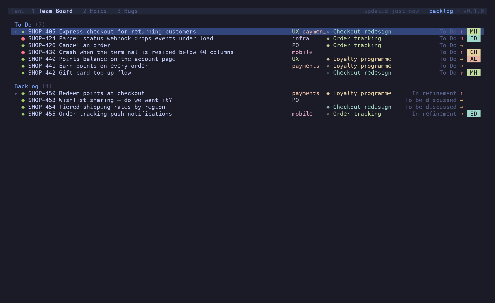

<p align="center">
  
</p>

<h1 align="center">lane</h1>

<p align="center">Your Jira board, in the terminal. Read it, move it, and never touch the mouse.</p>

<p align="center"><a href="https://candril.github.io/lane/"><strong>Documentation</strong></a> · <a href="https://candril.github.io/lane/guide/installation/">Install</a> · <a href="https://candril.github.io/lane/reference/key-bindings/">Key bindings</a> · <a href="https://candril.github.io/lane/reference/filtering/">Filtering &amp; search</a></p>

> [!CAUTION]
> **Spec-driven, AI-generated.** Every feature in lane starts as a numbered spec in [`specs/`](specs/), and the code and this documentation were generated from those specs with an AI pair. Use it with care: lane *writes* to Jira Cloud — transitions, assignments, labels, ranks. Start with `lane --mock`, then a board you don't mind poking at.

```sh
brew install candril/tap/lane           # or: nix run github:candril/lane
lane --mock                             # the offline demo board — no Jira needed
```


---

### A board that reads like a board

Columns come from your config, not from whatever Jira decided to render. Cards carry the type glyph, key, summary, priority, points, assignee, epic and labels — and nothing else competing for the line. `h j k l` moves the cursor, including onto empty cells, so every press is exactly one step. `⇧H` / `⇧L` moves the card under the cursor, which *is* a Jira transition; `⇧J` / `⇧K` re-ranks it.


### Group it the way you think about it

`g p` lanes by parent — each story with its sub-tasks spread across the columns. `g r` lanes by sprint on a scrum board, `g t` by type, `g s` by JQL swimlanes you define per board. `c` collapses a column you don't care about today.




### Sub-tasks, four ways

Each sub-task in its own status column with a `↳PARENT` tag, nested under its parent, folded into the parent card as a checklist row, or trayed per parent in a basket. `v o/u/c/g` switches per tab; `v a/d/n` shows all children, hides the done ones, or hides them all.




### The issue, without leaving

`↵` opens the viewer: fields, the description rendered as Markdown, children, and a folded **history** — who changed what, when. `j`/`k` walk the links, `↵` drills in, `⌫` backs out. `↵` on a text edit in the history shows it as a diff.


### Edit in place, optimistically

Create (`n` / `⇧N`), rename (`e`), edit title and body in `$EDITOR` (`i`), assign (`a`), labels (`#`), epic (`⇧E`), status (`⇧S`), close *as* a reason (`⇧R`). The board updates at once and snaps back if Jira says no. Mark issues with `space`, `^A` or a `⇧V` range and every one of those acts on the whole selection.


### One filter language, two prompts

`/` narrows what is loaded, live. `:` searches all of Jira. Both parse the same grammar — `type:bug @me #UX epic:KEY -is:done` — or a key, or raw JQL. A search result set becomes a tab with `^T`, and then it's a board like any other.




### Everything at your fingertips

`^P` opens the palette — every action for the current state, with its shortcut. `?` shows the whole keymap. `s` labels every visible card so you can jump without scrolling.




---

## Features

- **Board, list and backlog views** — `v b/l/k`; backlog statuses stay off the board and `⇧J`/`⇧K` ranks across the divider
- **Groupings** — none, by parent, by type, JQL swimlanes, by sprint (`g n/p/t/s/r`)
- **Sub-task layouts** — own column, under the parent, checklist, baskets (`v o/u/c/g`); child visibility all / hide done / none (`v a/d/n`)
- **Grid cursor** — `h j k l` onto empty cells too; `s` flash-jump; `gg` / `⇧G`; `^D` / `^U`
- **Folding** — `z a/o/c` for sub-tasks, lanes and rows, `z ⇧R` / `z ⇧M` for everything, `c` / `⇧C` for columns
- **Issue viewer** — Markdown description, links you can walk and drill into, history with diffs
- **Editing** — create, rename, `$EDITOR` for title + body (Markdown ↔ ADF), assign, labels, epic, status, close reason
- **Bulk edit** — `space`, `^A` (siblings → cell → lane → board), `⇧V` ranges; field editors and copies fan out
- **Copy** — key, URL, title, description as Markdown (`y`, `⇧Y`, `⇧U`, `⇧D`); open in the browser or a tmux window
- **Filter & search** — one grammar for `/` and `:`; `@` assignee, `#` label, `epic:`, `type:`, `is:`, `-` negates; quick filters on `f`+letter
- **Tabs** — every `[[boards]]` entry, query tabs from search (`^T`), cloned tabs (`⇧T c`) that survive a restart
- **Epics** — tags on cards, `epic:` in the filter, `⇧E` to re-link, an epic tab where epics are the parents
- **Instant boot** — cached snapshot per board, refreshed in the background and when the terminal regains focus
- **Config-driven** — columns, JQL, swimlanes, default view and grouping per board; `lane import <board-id>` scaffolds one from a real Jira board
- **Command palette** and a shortcut dialog, so nothing has to be memorised

## Install

```sh
brew install candril/tap/lane
```

```sh
nix run github:candril/lane              # try it; `nix profile install github:candril/lane` keeps it
```

```sh
curl -fsSL https://raw.githubusercontent.com/candril/lane/main/scripts/install.sh | bash
```

All three install the same binary — the one attached to the latest
[release](https://github.com/candril/lane/releases), verified against its `SHA256SUMS` — prebuilt
for macOS (Apple Silicon, Intel) and Linux (x64, arm64). The installer puts it in `/usr/local/bin`;
`LANE_INSTALL_DIR=~/.local/bin` moves it, `LANE_VERSION=0.1.0` pins it.

From source, with [Bun](https://bun.sh): `git clone https://github.com/candril/lane.git && cd lane && bun install && just install-bin`.

## Setup

lane needs three things: your Jira URL, your account email, and an API token. The token comes from the environment and only from there:

```sh
export JIRA_API_TOKEN="…"      # https://id.atlassian.com/manage-profile/security/api-tokens
```

The URL and email are read from the [`jira` CLI](https://github.com/ankitpokhrel/jira-cli) config at `~/.config/.jira/.config.yml` (`server:` and `login:`), so if you use that tool there is nothing new to set up.

Then describe a board in `~/.config/lane/config.toml` — or let lane read it off a real one:

```sh
lane import 1234 >> ~/.config/lane/config.toml   # the id from the board's URL
```

```toml
[jira]
project = "SHOP"

  [[jira.columns]]
  title = "To Do"
  statuses = ["Open", "Ready"]

  [[jira.columns]]
  title = "In Progress"
  statuses = ["In Progress"]

  [[jira.columns]]
  title = "Done"
  statuses = ["Resolved", "Closed"]

[[boards]]
name = "Team Board"
jql = "project = SHOP AND sprint in openSprints()"
grouping = "parent"
```

See [`config.example.toml`](./config.example.toml) for every key, and the [docs](https://candril.github.io/lane/) for the long version.

## Key bindings

Press `?` in the app for the same list.

### Navigation

| Key | Action |
|-----|--------|
| `h` `j` `k` `l` | move the cursor |
| `gg` / `⇧G` | top / bottom |
| `^D` / `^U` | half a screen down / up |
| `s` | jump: label every visible card, type the label |
| `⇧H` / `⇧L` | move the card to the previous / next column |
| `⇧J` / `⇧K` | re-rank the card |
| `↵` | fold / unfold a lane header; open the issue on a card |
| `z a` / `z o` / `z c` | toggle / open / close the fold under the cursor |
| `z ⇧R` / `z ⇧M` | unfold / fold everything |
| `c` / `⇧C` | collapse the column / expand all |

### View

| Key | Action |
|-----|--------|
| `v b` / `v l` / `v k` | board / list / backlog |
| `v o` / `v u` / `v c` / `v g` | sub-tasks: own column / under parent / checklist / baskets |
| `v a` / `v d` / `v n` | children: all / hide done / none |
| `g n` / `g p` / `g t` / `g s` / `g r` | group: none / parent / type / swimlanes / sprint |
| `t e` / `t l` / `t a` | toggle epic / label / all tags |
| `/` | filter this board |
| `f` + letter | quick filter from `[filters]` |
| `⇧F` | sub-tasks: match on their own, or follow a matching parent |
| `esc` | clear the filter |

### Issue

| Key | Action |
|-----|--------|
| `↵` | view the issue; inside: open the link, or show an edit as a diff |
| `j` `k` / `⌫` | walk the viewer's links and history / back out |
| `n` / `⇧N` | new issue in context / top-level (`^T` cycles the type) |
| `e` / `i` | rename / edit title and body in `$EDITOR` |
| `a` / `#` / `⇧E` / `⇧S` | assign / labels / epic / status |
| `⇧R` | close as a reason, or change why it closed |
| `o` / `⇧O` | open in the browser / in a tmux window |
| `y` / `⇧Y` / `⇧U` / `⇧D` | copy key / URL / title / description |
| `space` / `^A` / `⇧V` | mark / mark siblings, then cell, lane, board / visual range |

### Find, tabs, general

| Key | Action |
|-----|--------|
| `:` | search Jira — words, a key, or JQL; `^A` toggles the scope, `^T` keeps the results as a tab |
| `1`–`9`, `[` / `]` | switch tabs |
| `⇧T c` / `⇧T r` / `⇧T x` | clone / rename / close a tab |
| `r` | refresh |
| `^P` | command palette |
| `?` | shortcuts |
| `q` / `^C` | quit |

## Filter grammar

```
/ type:bug @me #UX -is:done      bugs of mine, not done
/ epic:SHOP-100 payments         free text plus a field
: SHOP-412                       jump to a key
: @ada checkout                  search Jira with the same grammar
: project = OPS AND labels = infra    …or write JQL
```

Repeating a field ORs within it, different fields AND across, `-` negates, quotes hold spaces. Free text fuzzy-matches key, summary, assignee, labels and epic.

## Tech stack

- **Runtime**: [Bun](https://bun.sh)
- **UI**: [OpenTUI](https://github.com/sst/opentui) (React reconciler for the terminal), React 19
- **Language**: TypeScript

## The other terminal tools

lane is one of five, built the same way and installed the same way (`brew install candril/tap/<tool>`, `nix run github:candril/<tool>`, or the curl installer):

- [**monq**](https://candril.github.io/monq/) — Browse, query, edit. MongoDB without leaving the terminal.
- [**presto**](https://candril.github.io/presto/) — Every open PR across the repos you watch, in one list — and whose move it is.
- [**riff**](https://candril.github.io/riff/) — Review the diff where you wrote it: PRs, branches and working-copy changes, with vim motions and inline comments.
- [**topiq**](https://candril.github.io/topiq/) — Peek, filter, replay. Kafka without leaving the terminal.

## Development

```sh
just mock          # hot reload against the demo board
just dev           # hot reload against Jira
just test          # bun test
just check         # typecheck + lint + fmt-check
just shots         # regenerate the docs screenshots (tmux + python3/Pillow)
```

Specs for every feature live in [`specs/`](./specs/); the docs site source in [`site/`](./site/).

## License

MIT

---

<p align="center"><sub>One of five terminal tools — one spec-first process, the same three installers:<br><a href="https://candril.github.io/lane/">lane</a> (Jira) · <a href="https://candril.github.io/monq/">monq</a> (MongoDB) · <a href="https://candril.github.io/presto/">presto</a> (pull requests) · <a href="https://candril.github.io/riff/">riff</a> (code review) · <a href="https://candril.github.io/topiq/">topiq</a> (Kafka)</sub></p>
