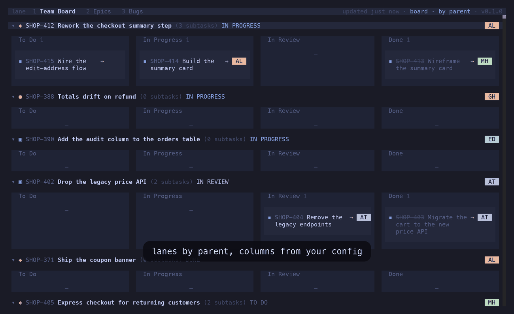
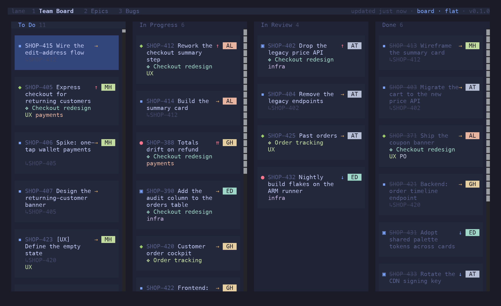
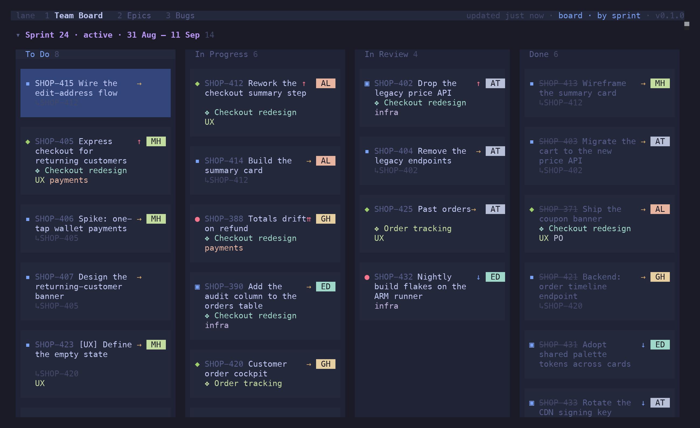
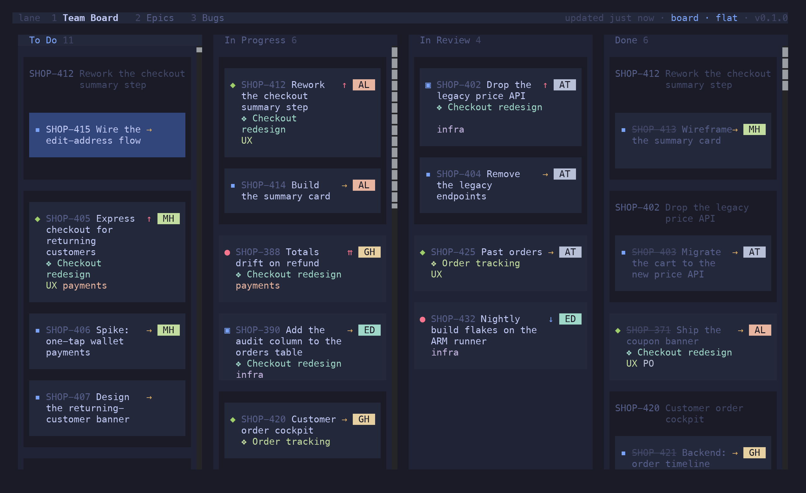
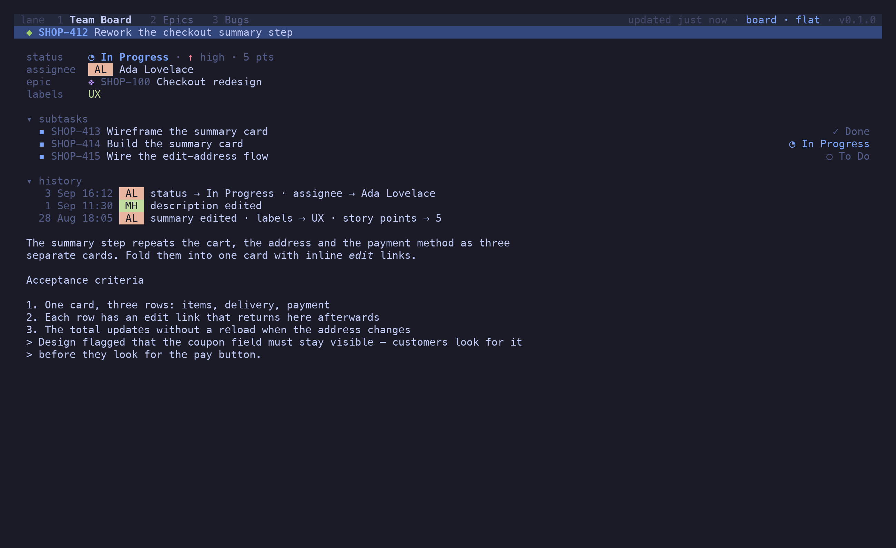
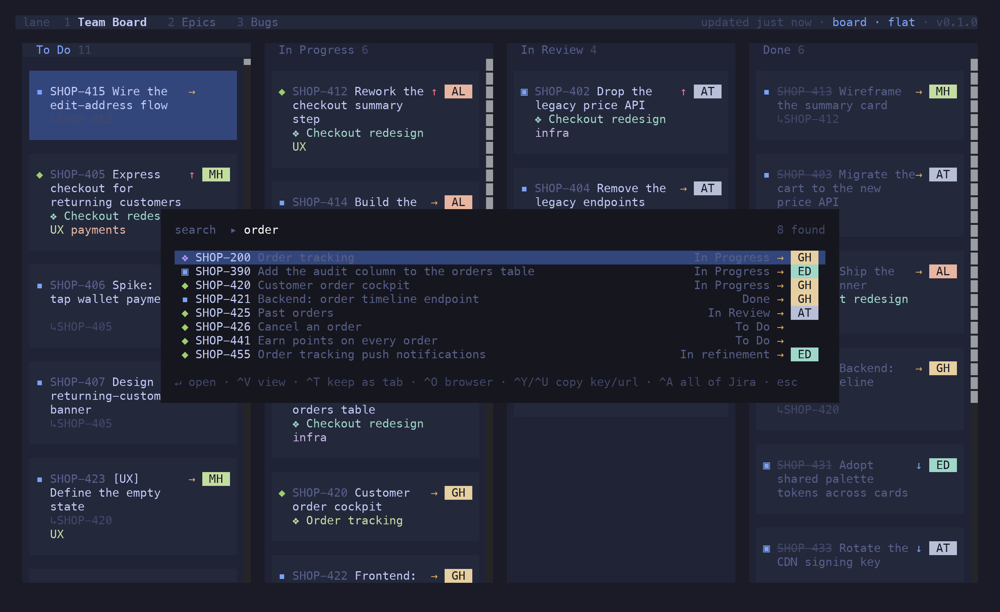
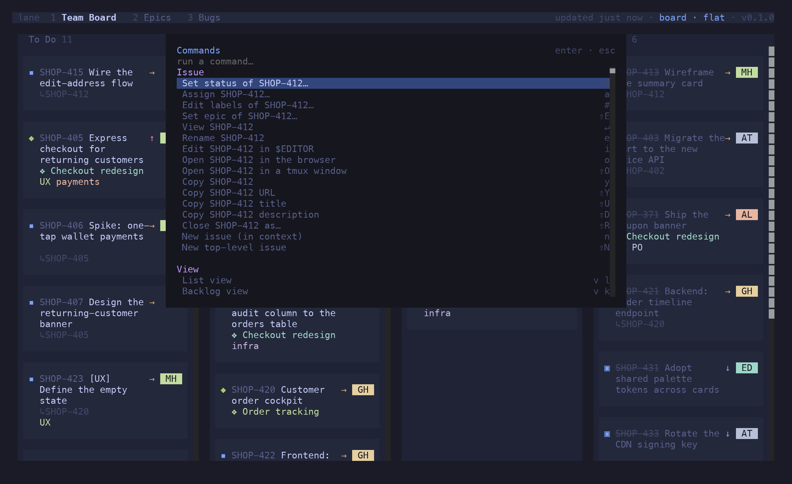

import { CardGrid, Card, Aside } from '@astrojs/starlight/components'

<Aside type="caution">
**Spec-driven, AI-generated.** Every feature in lane starts as a numbered spec in [`specs/`](https://github.com/candril/lane/tree/main/specs), and the code and this documentation were generated from those specs with an AI pair. Use it with care: lane *writes* to Jira Cloud — transitions, assignments, labels, ranks. Start with `lane --mock`, then a board you don't mind poking at.
</Aside>

```sh
brew install candril/tap/lane           # or: nix run github:candril/lane
lane --mock                             # the offline demo board — no Jira needed
```



## A board that reads like a board

Columns come from your config, not from whatever Jira decided to render. Cards carry the type
glyph, key, summary, priority, points, assignee, epic and labels — nothing else competing for the
line. `h j k l` moves the cursor, including onto empty cells, so every press moves exactly one
step. `⇧H` / `⇧L` moves the card under the cursor, which *is* a Jira status transition.
`⇧J` / `⇧K` re-ranks it.



## Group it the way you think about it

`g p` lanes by parent, each story with its sub-tasks across the columns. `g r` lanes by sprint on
a scrum board, `g t` by type, `g s` by JQL swimlanes you define per board.



## Sub-tasks, four ways

In their own status column with a `↳PARENT` tag, nested under the parent, folded into it as a
checklist row, or trayed per parent in a basket. `v o/u/c/g` switches per tab; `v a/d/n` shows
all children, hides the done ones, or hides them all.



## The issue, without leaving

`↵` opens the viewer: fields, the description as Markdown, children, and a folded history — who
changed what, when. `j`/`k` walk the links, `↵` drills in, `⌫` backs out, and `↵` on a text edit
in the history shows it as a diff.



## One filter language, two prompts

`/` narrows what is loaded. `:` searches all of Jira. Both parse the same grammar, so there is one
thing to learn:

```text
/ type:bug @me #UX -is:done          filter this board
: epic:SHOP-100 @ada payment         search Jira for it
: SHOP-412                           jump straight to a key
: project = SHOP AND sprint in openSprints()    …or just write JQL
```

Fields OR within themselves and AND across each other. `-` negates. `@` is an assignee, `#` a
label. A search result set can be kept as a tab with `^T` — at which point it's a board, and
every action works on it.



## Everything the keyboard can reach

<CardGrid>
  <Card title="Edit in place" icon="pencil">
    Create (`n`/`N`), rename (`e`), `$EDITOR` for title and body (`i`), assign (`a`), labels
    (`#`), epic (`⇧E`), status (`⇧S`), close as a reason (`⇧R`). Optimistic, reverted if Jira
    says no.
  </Card>
  <Card title="Bulk edit" icon="list-format">
    `space` marks, `^A` widens to siblings, cell, lane, board, `⇧V` ranges over rows. Every field
    editor and copy then acts on the whole selection.
  </Card>
  <Card title="Epics as first-class" icon="star">
    Epic tags on cards, `epic:` in the filter, `⇧E` to re-link or detach — and an epic tab where
    epics are the parents and their issues nest inside.
  </Card>
  <Card title="Backlog view" icon="document">
    Backlog statuses stay off the board. `v k` shows To Do and the backlog as an expandable list;
    `⇧J`/`⇧K` ranks across the divider.
  </Card>
  <Card title="Quick filters" icon="magnifier">
    Bind a filter query to a letter in config, apply it with `f`+letter. `f b` for bugs, `f m`
    for what's yours.
  </Card>
  <Card title="Flash jump" icon="rocket">
    `s` labels every visible card and lane; type the label to put the cursor there. No scrolling
    hunt on a wide board.
  </Card>
  <Card title="Command palette" icon="open-book">
    `^P` lists every action for the current state with its shortcut; `?` shows the whole keymap.
    Nothing has to be memorised.
  </Card>
  <Card title="Instant boot" icon="approve-check-circle">
    Each board's last snapshot is cached on disk. lane opens on it, then revalidates in the
    background — on an interval, and when the terminal regains focus.
  </Card>
  <Card title="Multi-instance" icon="setting">
    A board can point at its own Jira server and account. Mixed-project and cross-instance tabs
    sit side by side.
  </Card>
  <Card title="Import your real board" icon="external">
    `lane import <boardId>` reads a Jira board's columns and filter JQL and prints a pasteable
    config block.
  </Card>
</CardGrid>



## Install

```sh
brew install candril/tap/lane            # or: nix run github:candril/lane
curl -fsSL https://raw.githubusercontent.com/candril/lane/main/scripts/install.sh | bash
```

See the [installation guide](/lane/guide/installation/) for the Nix flake, the installer's
variables, requirements and first run.
