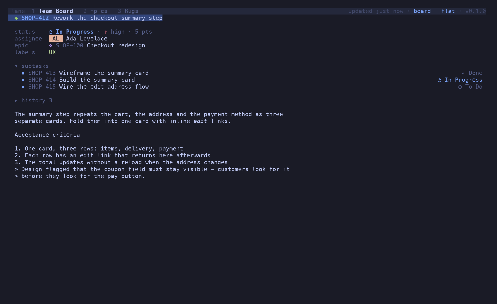
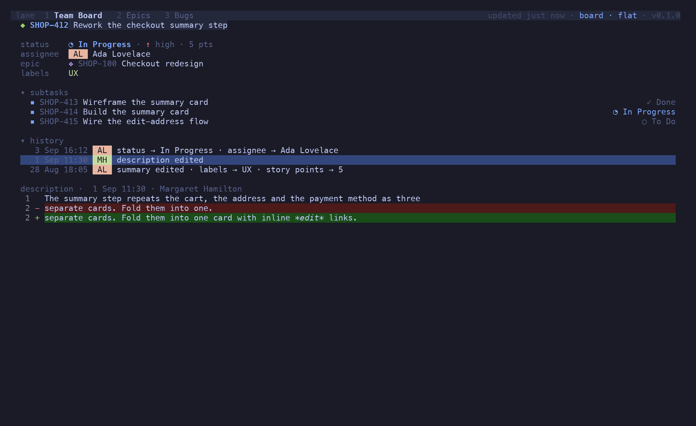
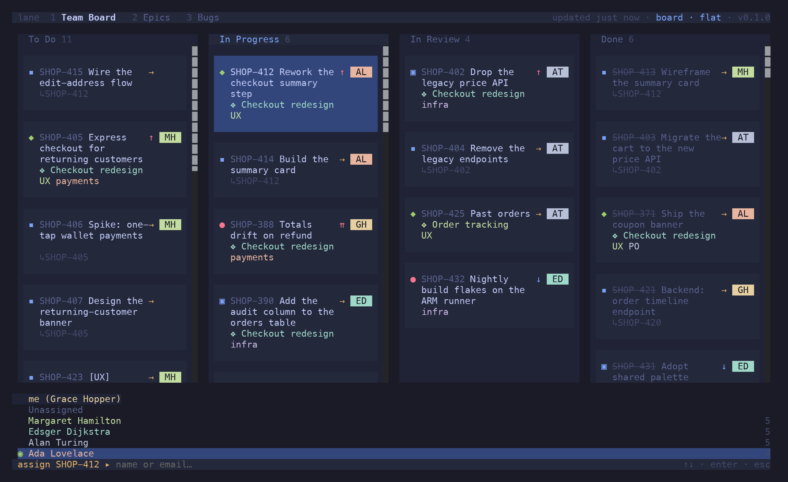
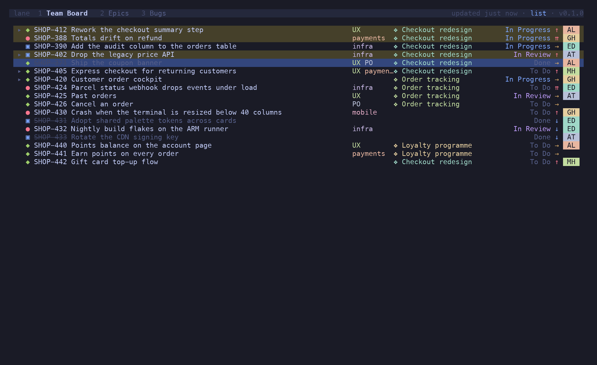
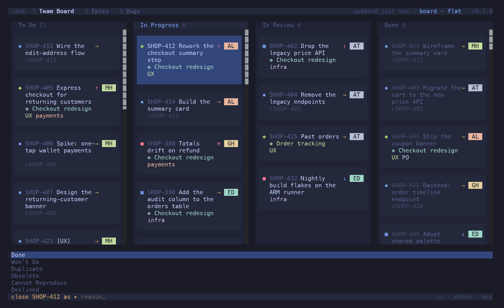

Everything on this page starts from the card under the cursor — or, once you have marked
some, from the selection.

## The viewer

`↵` on a card opens it: the fields, the sub-tasks or children with their statuses, a folded
history, and the description rendered as Markdown (Jira's ADF is converted on the way in).

The viewer is navigable. `j` / `k` (or `^N` / `^P`) walk its links — the parent, the epic, each
child, each history entry. `↵` on a link drills into that issue; `⌫` backs out again, as many
levels as you went. `/` filters the children. `gg` / `⇧G` jump to the first and last item.

Every issue action works inside the viewer and targets whatever is selected there: `⇧S` on a
child sets the child's status, `a` assigns it, `y` copies its key.

### History

`z h` unfolds the history: who changed what, when, newest first, with the churn (ranks, worklogs)
filtered out. `↵` on a text change — a description or summary edit — shows the old and new text
as a unified diff.

## Editing

| Keys | Does |
| --- | --- |
| `n` | new issue in context: a sub-task under the card, or a story in its epic; `^T` cycles the type |
| `⇧N` | new top-level issue |
| `e` | rename — an inline prompt for the summary |
| `i` | edit summary and description together in `$EDITOR`, as Markdown |
| `a` | assign: me, unassigned, anyone on the board, or a typed name |
| `#` | labels: toggle existing ones, type to add |
| `⇧E` | set or detach the epic, from the epics on the board |
| `⇧S` | set the status from the board's statuses |
| `⇧R` | close as a reason — Jira's resolution — or change a closed issue's reason in hindsight |
| `⇧H` / `⇧L` | move to the previous / next column |
| `⇧J` / `⇧K` | re-rank |

Every one of these is optimistic: the card changes at once, and snaps back with a toast if Jira
refuses. Moving a card into a column transitions the issue to that column's first status; into
Done, it also attaches the resolution the workflow asks for, so an ordinary `⇧L` works without a
dialog.

`i` hands the summary and body to `$EDITOR` in one buffer — a heading line, then Markdown — and
writes both back on save, converting to ADF. Headings, lists, tables, code, quotes, links and
checklists survive the round trip.

## Bulk actions

`space` marks the issue under the cursor. `^A` marks its siblings; pressed again it widens to the
cell, the lane, then the whole board. In the list and the viewer, `⇧V` starts a visual range that
`j` / `k` extend. `esc` clears.

With a selection, the field editors act on all of it: `⇧S` sets one status on every marked
issue, `a` assigns them all, `#` edits labels shared by all of them, `⇧E` re-links them, `⇧R`
closes them as one reason. The palette names the target — *Set status of 3 selected…* — so
there is no doubt what `↵` is about to do. Writes fan out per issue and revert individually,
so one refusal doesn't undo the others.

## Copying

| Keys | Copies |
| --- | --- |
| `y` | the key — or every marked key, one per line |
| `⇧Y` | the URL(s) |
| `⇧U` | the title(s) |
| `⇧D` | the description, as Markdown |

`o` opens the issue in the browser. `⇧O` opens it in a new tmux window, rendered by
`lane view <key>`, which is handy when the description is long and you want it beside the board.

## Closing with a reason

Jira's Done transitions usually require a *resolution*, and which one is a workflow fact. `⇧R`
lists the instance's resolutions — Done, Won't Do, Duplicate, … — and transitions the issue
into Done carrying the one you pick. On an issue that is already closed, the same key changes
the reason without touching the status.

`default_resolution` in the config is what a plain `⇧L` into Done sends when you didn't pick
one.
