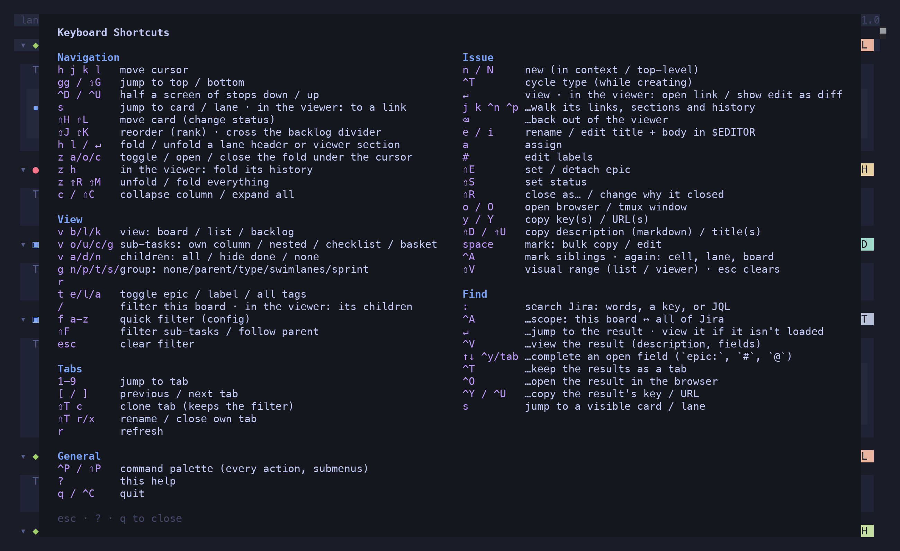
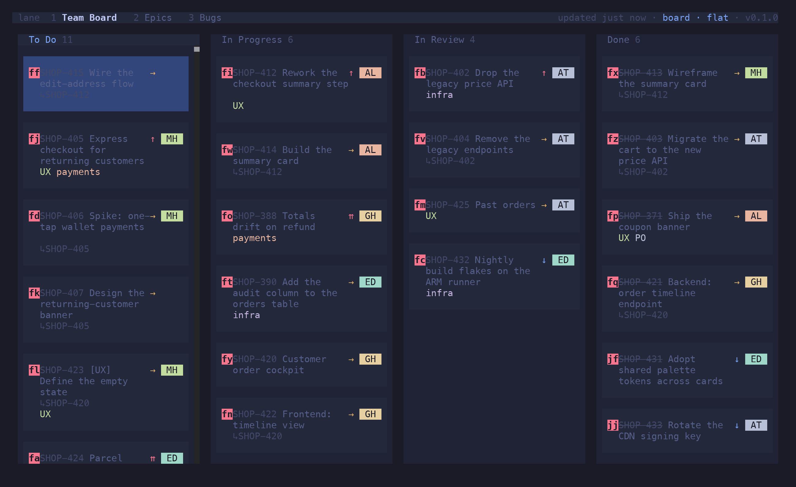

lane is vim-flavoured: lowercase moves the cursor, uppercase moves the thing under it, and
chords (`v`, `g`, `t`, `z`, `f`, `⇧T`) group related actions behind a prefix.

Press `?` at any time for this list in the app. `esc`, `?` or `q` closes it.

## Navigation

| Keys | Action |
| --- | --- |
| `h` `j` `k` `l` | move the cursor |
| `gg` / `⇧G` | jump to top / bottom (in the viewer: first / last item) |
| `^D` / `^U` | half a screen of stops down / up |
| `s` | jump to a card or lane — labels appear, type one; in the viewer: to a link |
| `⇧H` `⇧L` | move the card to the previous / next column (a status transition) |
| `⇧J` `⇧K` | reorder (rank) — crosses the backlog divider |
| `h` `l` / `↵` | on a lane header or a viewer section: fold / unfold |
| `z a` / `z o` / `z c` | toggle / open / close the fold under the cursor: sub-tasks, a lane, a row, a viewer list |
| `z h` | in the viewer: fold / unfold its history |
| `z ⇧R` / `z ⇧M` | unfold / fold everything |
| `c` / `⇧C` | collapse the column under the cursor / expand all |

The cursor addresses cells, not cards: an empty cell is a valid position, so `h` `j` `k` `l`
always moves exactly one step instead of skipping across gaps.

## View

| Keys | Action |
| --- | --- |
| `v b` / `v l` / `v k` | view: board / list / backlog |
| `v o` / `v u` / `v c` / `v g` | sub-tasks: own column / under the parent / checklist / baskets |
| `v a` / `v d` / `v n` | children: all / hide the done ones / none |
| `g n` / `g p` / `g t` / `g s` / `g r` | group: none / parent / type / swimlanes / sprint |
| `t e` / `t l` / `t a` | toggle epic tags / label tags / all tags on cards |
| `/` | filter this board; in the viewer: its children |
| `f` `a`–`z` | apply a quick filter from `[filters]` |
| `⇧F` | filter sub-tasks strictly, or let them follow their parent |
| `esc` | clear the filter |

View, grouping, layout, filter and tag visibility are per tab, and are restored on the next
launch.

## Issue

| Keys | Action |
| --- | --- |
| `↵` | view the issue; in the viewer: open the selected link, or show a text edit as a diff |
| `j` `k` / `^N` `^P` | in the viewer: walk its links, sections and history |
| `⌫` | back out of the viewer |
| `n` / `⇧N` | new issue, in the cursor's context / top-level |
| `^T` | cycle the issue type — while the create prompt is open |
| `e` | rename |
| `i` | edit title and body in `$EDITOR` |
| `a` | assign |
| `#` | edit labels |
| `⇧E` | set or detach the epic |
| `⇧S` | set status from a picker of the board's statuses |
| `⇧R` | close as a reason, or change why a closed issue closed |
| `o` / `⇧O` | open in the browser / in a tmux window |
| `y` / `⇧Y` | copy the issue key / URL |
| `⇧D` / `⇧U` | copy the description as Markdown / the title |

Every mutation is optimistic — the board updates at once and reverts if Jira refuses.

### Selection

| Keys | Action |
| --- | --- |
| `space` | mark the issue under the cursor |
| `^A` | mark its siblings; again: the cell, the lane, the board |
| `⇧V` | visual range, in the list and the viewer |
| `esc` | clear the selection |

With a selection, `⇧S`, `a`, `#`, `⇧E`, `⇧R` and the copy keys act on every marked issue.

## Find

| Keys | Action |
| --- | --- |
| `:` | search Jira: words, a key, or JQL |
| `^A` | …toggle scope: this board ↔ all of Jira |
| `↑` `↓` `^Y` `tab` | …complete an open field (`epic:`, `#`, `@`) |
| `↵` | …jump to the result — view it if this board doesn't have it |
| `^V` | …view the result (description, fields) |
| `^T` | …keep the results as a tab |
| `^O` | …open the result in the browser |
| `^Y` / `^U` | …copy the result's key / URL |
| `s` | jump to a card or lane that's already visible |

`/` and `:` speak the same grammar — see [Filtering & Search](/lane/reference/filtering/).

## Tabs

| Keys | Action |
| --- | --- |
| `1`–`9` | jump to a tab |
| `[` / `]` | previous / next tab |
| `⇧T c` | clone this tab, keeping its filter |
| `⇧T r` / `⇧T x` | rename / close a tab you made |
| `r` | refresh |

`⇧T r` and `⇧T x` only act on tabs you created; config-defined boards can't be renamed or closed
from inside the app. Yours are tinted in the tab bar so you can tell which is which.

## General

| Keys | Action |
| --- | --- |
| `^P` / `⇧P` | command palette |
| `?` | this help |
| `q` / `^C` | quit |

:::note
Some terminals send an uppercase letter with the shift flag unset. lane normalises the raw key
before dispatching, so `⇧H` works the same everywhere.
:::
