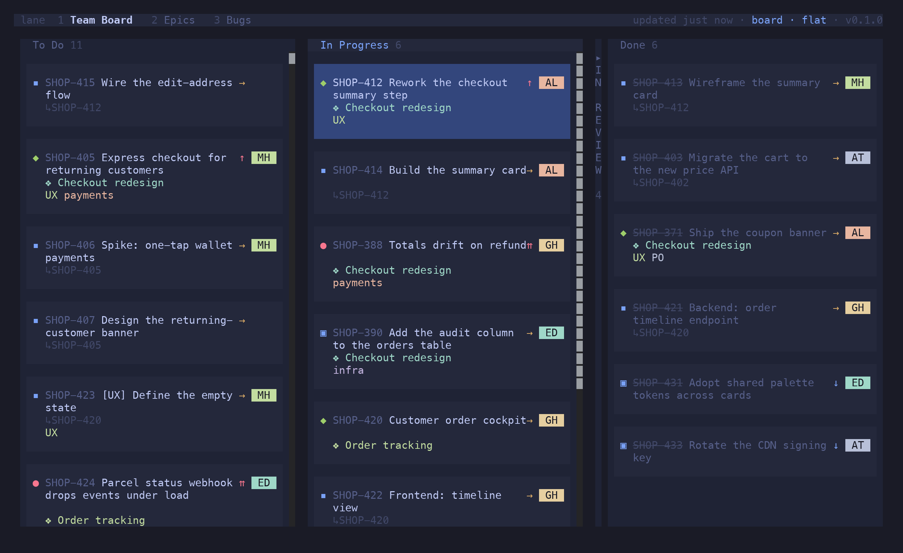
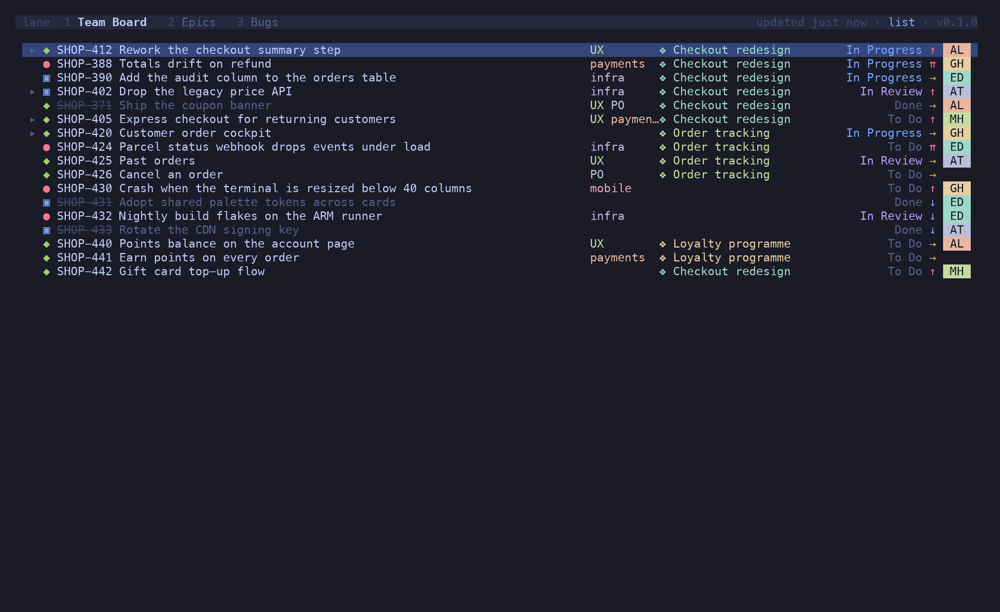
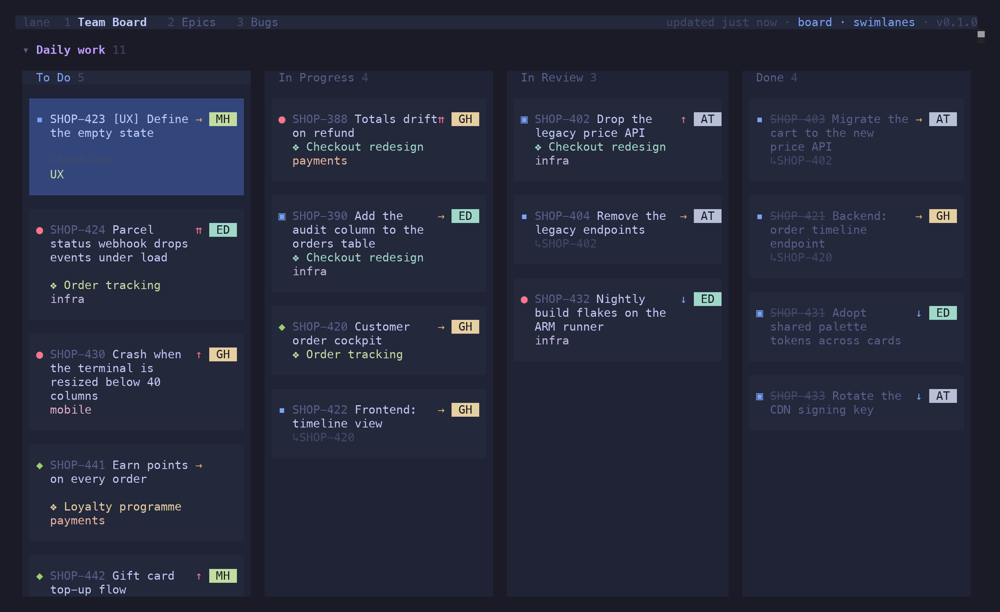
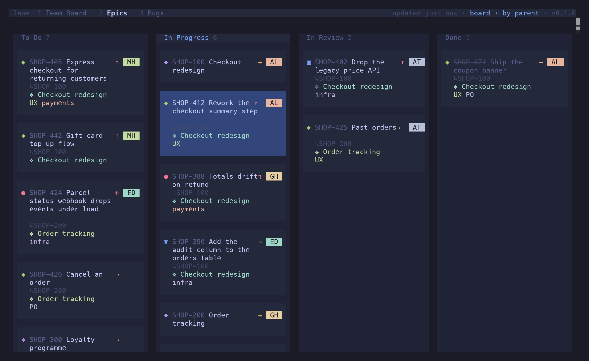
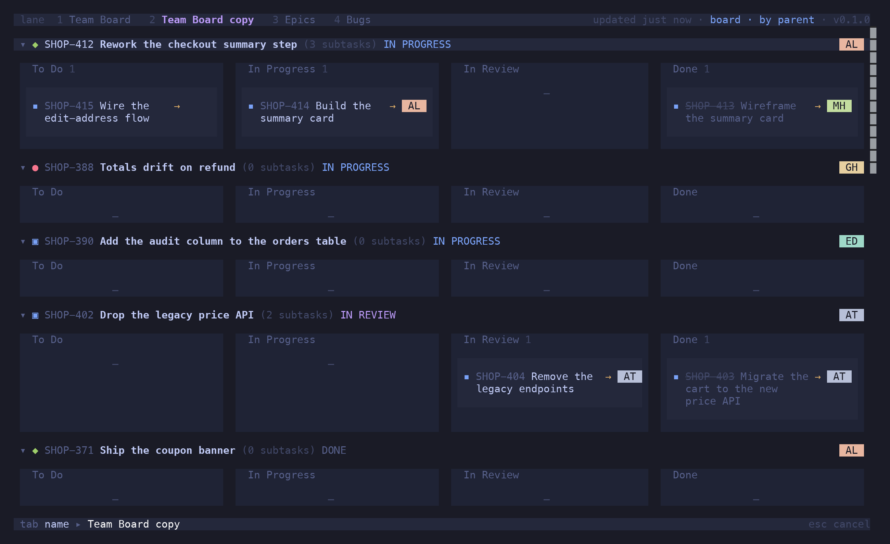

A tab is not a board. A **source** owns the data — a provider, its query, and the snapshot it
fetched. A **tab** owns a projection of that data: view mode, filter, grouping, layout and tag
visibility. Several tabs can point at one source, which is why a board and its backlog cost one
fetch, and why switching between them is instant.

Everything on this page is per tab, and all of it is restored on the next launch.

## View modes

`v b` / `v l` / `v k`.

### Board (`v b`)

Columns across, cards down. The cursor addresses cells rather than cards, so an empty cell is a
valid position and every `h` `j` `k` `l` moves exactly one step.


`c` collapses the column under the cursor to a narrow strip with its title spelled vertically
and a count; `⇧C` expands them all again. Useful when four of your six columns are noise today.



### List (`v l`)

One row per issue, dense: type, key, summary, labels, epic, status, priority, assignee. The
same filter, grouping and actions apply, and `⇧V` ranges over rows.



### Backlog (`v k`)

Available on a board that declares `backlog_statuses`, or whose issues carry sprints. Those
statuses are kept **off** the board — an issue in one of them would otherwise fall into the
first column and pretend to be started. The backlog view shows To Do and Backlog together as an
expandable list, and `⇧J` / `⇧K` ranks across the divider between them.


## Groupings

`g n` / `g p` / `g t` / `g s` / `g r`. The header shows which is active.

| Grouping | Lanes are |
| --- | --- |
| `none` (flat) | no lanes — just the columns |
| `parent` | one lane per parent issue, its sub-tasks inside |
| `type` | one lane per issue type |
| `swimlanes` | one lane per `[[boards.swimlanes]]` entry, matched by JQL |
| `sprint` | one lane per live sprint, active first, then a *No sprint* lane |


Query swimlanes are defined per board:

```toml
[[boards.swimlanes]]
name = "PO/UX stream"
jql = "labels in (UX, PO)"

[[boards.swimlanes]]
name = "Everything else"
jql = "labels not in (UX, PO) OR labels is EMPTY"
```



`h` / `l` / `↵` on a lane header folds it. `z ⇧M` folds everything, `z ⇧R` unfolds it.

### Sprints

The `sprint` grouping appears once the board's issues carry sprints — set `sprint_field` in
`[jira]` and lane reads the active and upcoming ones. Each lane names its sprint, its state
and its dates. `sprint_board_id` on the board keeps the lanes to that Jira board's own sprints,
since two boards routinely name theirs the same.


### Parent grouping, one level up

The `parent` lane is whichever issue the card actually hangs off *within the loaded set*: its
sub-task parent, or — if that isn't loaded but its epic is — its epic.

That is what makes an **epic board** work. Load a team's epics alongside their issues and each
issue nests under its epic, one hierarchy level up from the usual story/sub-task pair. A board
without epics resolves exactly as before, since the epic link never finds a match:

```toml
[[boards]]
name = "Epics"
jql = "project = SHOP AND (type = Epic OR parent in (...)) ORDER BY Rank ASC"
grouping = "parent"
```



## Sub-task layouts

Where sub-tasks sit in the flat, by-type, swimlane and sprint views. The default comes from
`[display]`; `v o` / `v u` / `v c` / `v g` switch it per tab. The by-parent view always spreads
sub-tasks across their own columns and ignores this.

```toml
[display]
subtasks = "own-column"   # own-column | under-parent | checklist | basket
```

| Layout | What you get |
| --- | --- |
| `own-column` (`v o`) | each sub-task sits in the column matching **its own** status, tagged `↳PARENT` so the link stays visible (the default) |
| `under-parent` (`v u`) | each sub-task nests under its parent in the parent's column, indented with `↳` and badged with its own status |
| `checklist` (`v c`) | each sub-task becomes a compact row *inside* the parent card — a status icon, no key, still selectable, status changed in place with `⇧H` / `⇧L` |
| `basket` (`v g`) | own-column cells, with each parent's run of cards wrapped in a tray headed by the parent |


`z a` / `z o` / `z c` folds the sub-tasks of the card under the cursor; a folded parent shows
`▸ 3 subtasks`.

### Child visibility

Orthogonal to the layout: `v a` draws every child, `v d` hides the done ones so a long-lived
story stops dragging its finished sub-tasks through the Done column, `v n` draws parents only.
A parent says how many children it isn't showing.

## Card decorations

`t e` toggles epic tags, `t l` label tags, `t a` both. Per tab, since a backlog is read down the
epic while a board is read across the columns and the same setting rarely suits both. The
starting state comes from `[display]`:

```toml
[display]
epics = true
labels = true
```

Tag colours are hashed from the label or epic key, so a given tag keeps its colour on every
card and the cards sharing one read as a group.

## Tabs

Every `[[boards]]` entry is a tab, in config order. A board with backlog statuses adds a backlog
tab pointing at the same source.

| Keys | Action |
| --- | --- |
| `1`–`9` | jump to a tab |
| `[` / `]` | previous / next |
| `⇧T c` | clone this tab, keeping its filter |
| `⇧T r` / `⇧T x` | rename / close — tabs you made only |
| `r` | refresh |

### Tabs you make

`⇧T c` clones the active tab into one of your own: same source, same filter, its own name. It's
the answer to "I want to keep looking at this while I go do something else" — the incident's
issues, this epic's stragglers, what you filtered down to ten minutes ago.



Your tabs are tinted in the tab bar rather than badged — the bar is one line, and a glyph per
tab eats it — so you can see at a glance which ones `⇧T r` and `⇧T x` will act on. They persist
across restarts.

A search kept with `^T` (see [Filtering & Search](/lane/reference/filtering/)) makes a tab too,
but backed by a query rather than a config board.

## Refresh

Boards boot from an on-disk snapshot and revalidate in the background — stale-while-revalidate,
so lane opens instantly instead of blocking on a multi-second fetch. The header shows
`⟳ refreshing` while a fetch is in flight and `updated 4m ago` otherwise, turning amber once the
data is roughly twice the refresh interval old.

```toml
[refresh]
interval = 60      # seconds; 0 disables the poll
on_focus = true    # refresh when the terminal regains focus
```

`r` refreshes now. A snapshot is keyed by the board's identity — project, JQL and columns — so
changing the config misses the stale entry rather than showing you the wrong board.
